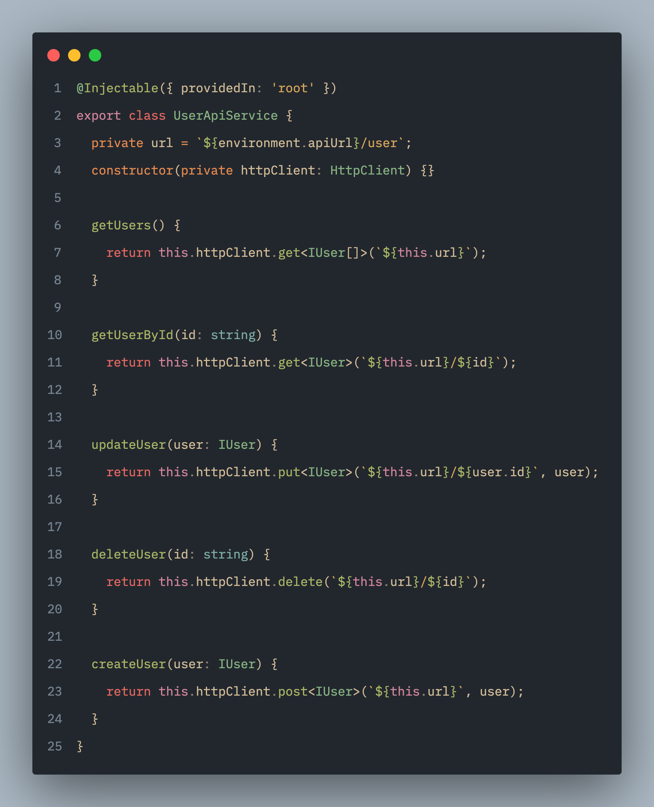

En Angular, como en la mayoría de frameworks modernos, podemos encontrar funcionalidades que nos permiten dotar a nuestros componentes de lógicas complejas. La mayoría de estas herramientas nos permiten inyectar funciones y variables que descomponen la lógica en piezas, simplificando así la responsabilidad del componente. Sin embargo, pocos conocen la flexibilidad y las diversas utilidades que estas pueden ofrecer a lo largo del desarrollo de un producto. A continuación, te dejaré algunos ejemplos prácticos para sacarles el máximo provecho.

## 1. Llamados a servicios Backend HTTP. 🔛

Este es el uso más común que se le da a los servicios y, de hecho, es el que encontraremos con mayor frecuencia. Generalmente, estos servicios contienen una URL asociada a una entidad y cuentan con una cantidad de funciones equivalente al número de *endpoints* que el backend provea para dicha ruta. Un ejemplo de esto sería:

### Consideraciones importantes 🤔
Al utilizar un servicio para este tipo de llamados, generalmente se busca mantener la máxima consistencia con el backend, evitando incluir lógicas adicionales que gestionen información propia de nuestra aplicación. Estos servicios suelen ser fieles al diseño original definido en cada *endpoint*.

## 2. Servicios como estados. 🧠
La gestión del estado es un aspecto fundamental en el desarrollo frontend actual. Con la evolución del ecosistema y el aumento de la complejidad en las aplicaciones, han surgido diversas librerías dedicadas a esta tarea. Sin embargo, en sus versiones más recientes, Angular permite gestionar el estado de forma más sencilla mediante el uso de servicios y *signals*. Esto facilita mantener un estado centralizado en la aplicación, así como integrar y gestionar nuevas funcionalidades de manera más eficiente. A continuación, veremos un ejemplo práctico de cómo implementarlo.

### Consideraciones importantes 🤔

Generalmente, un servicio que gestiona el estado debe estar bien segmentado y contar con una abstracción precisa. Una denominación demasiado ambigua podría llevar al equipo a concentrar demasiada lógica en un solo archivo, lo que dificulta su mantenimiento. Es importante recordar que, aunque el backend define una estructura para modelar la información de los datos, es el frontend quien debe encargarse de dividir y presentar esta información en diferentes vistas.

## 3. Servicios como utilidades. 🛠️

En ocasiones, necesitamos centralizar el uso de una utilidad o función que no depende de ninguna interfaz, generalmente para realizar cálculos, conversiones o aprovechar funcionalidades propias del lenguaje. Cuando no sabemos cómo organizar este conjunto de operaciones, podemos agruparlas según un criterio abstracto y exponerlas como un servicio. A continuación, veremos un ejemplo de este enfoque.

## 4. Servicios que encapsulan librerias. 💊

Muchas veces, para facilitar y agilizar el desarrollo, recurrimos a la web en busca de una librería que cubra una necesidad específica. Sin embargo, aunque esto puede acelerar el trabajo, también introduce una nueva dependencia externa. Esto significa que, si dicha librería falla o deja de actualizarse, nos veremos obligados a realizar una migración. Si empezamos a importar y utilizar esta dependencia libremente en múltiples archivos, dicha migración se volverá mucho más compleja, ya que tendremos que localizar y modificar cada lugar donde fue usada.

Por el contrario, si encapsulamos esta dependencia y hacemos que todo el proyecto dependa de nuestra propia abstracción, podremos reemplazarla fácilmente cuando sea necesario realizar cambios. Un ejemplo de esto es el caso de *lodash*: en muchos proyectos se utilizaba extensamente, pero con la evolución de JavaScript, muchas de sus funcionalidades se reimplementaron de forma nativa, y este sería un ejemplo de como sería la migración si tenemos la librería encapsulada.

### Consideraciones importantes 🤔

Cuando realizamos esta abstracción, todos los archivos que utilizan el servicio continuarán funcionando de la misma manera, siempre que no dependamos directamente de interfaces propias de la librería.

## 5. Servicios como Fachada 🏗️🔨🧠🔛

Ahora bien, si creamos una diversidad de servicios (de librerías, utilidades, API y estado), necesitamos orquestar todas estas fuentes de información. Es importante tener en cuenta que una fachada no es obligatoria, pero resulta útil para organizar la lógica cuando dependemos de múltiples puntos de origen y, además, facilita su reutilización en el futuro. Para este ejemplo, utilizaremos todo lo aprendido previamente:

### Consideraciones importantes

Como podemos ver, aquí hemos compuesto una lógica compleja en la función getUsers, la cual asume más de una responsabilidad. Es importante saber cómo fragmentar nuestras fachadas, ya que estas pueden llegar a concentrar múltiples responsabilidades si no se diseñan correctamente, lo que dificulta su mantenimiento y escalabilidad. No obstante, en este escenario, su propósito es claro.

# Resultado final 😍

Después de segmentar nuestra lógica en diversas capas y servicios, podemos confiar en que los cambios serán más sencillos de implementar y que nuestros componentes se mantendrán limpios y fáciles de mantener. A continuación, veremos un componente que realiza una consulta, muestra un estado de *loading*, verifica que los usuarios estén activos y permite filtrarlos. Sin embargo, a primera vista, su estructura parece más simple de lo que realmente es. ¿No es así 😏?

